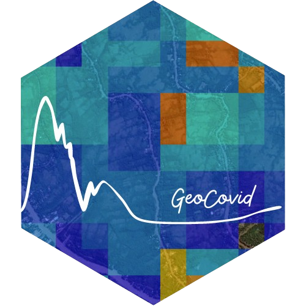
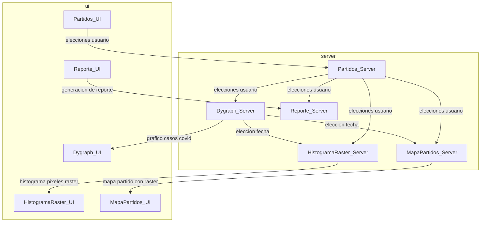
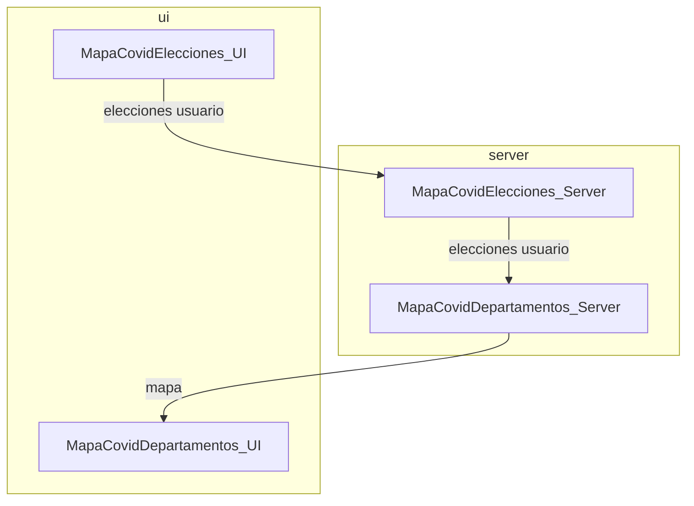

# GeoCovid App 

<!-- README.md is generated from README.Rmd. Please edit that file -->
<!-- badges: start -->

[](https://github.com/Fernandez-Lab-WSU/geocovid_app/actions/workflows/R-CMD-check.yaml)
[](https://lifecycle.r-lib.org/articles/stages.html#experimental)
<!-- badges: end -->

ESTE PAQUETE SE ENCUENTRA EN REVISION. ES UNA VERSION PRELIMINAR.

## Instalación

Si queres instalar una versión de GeoCovid App podes hacerlo ejecutando
el siguiente código en R:

``` r
# install.packages("devtools")
devtools::install_github("Fernandez-Lab-WSU/geocovidapp")
geocovidapp::runapp()
```

## Tabs

### Tab 1


## Tab 2 



## Tab3



## Licencias

El código contenido en este repositorio se encuentra bajo una [licencia
MIT](https://github.com/Fernandez-Lab-WSU/geocovidapp/blob/main/LICENSE.md).

## Código de Conducta

El proyecto GeoCovid Buenos Aires, GeoCovid app y el paquete `quadkeyr`
se encuentran bajo un [Código de
Conducta](https://www.contributor-covenant.org/es/version/1/4/code-of-conduct/).
